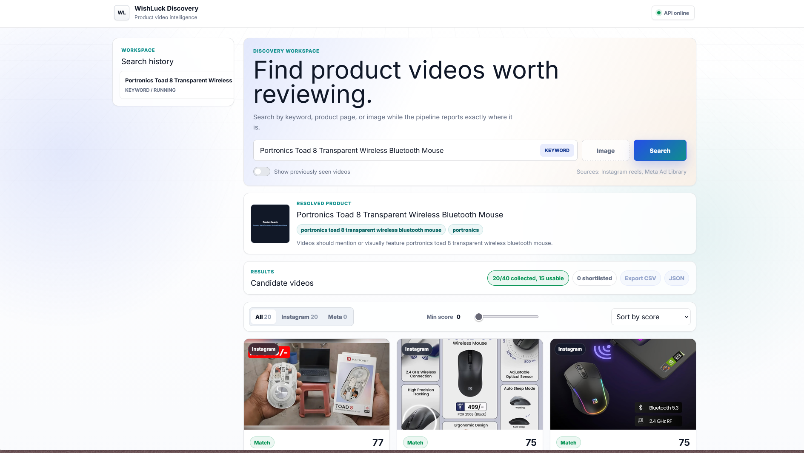
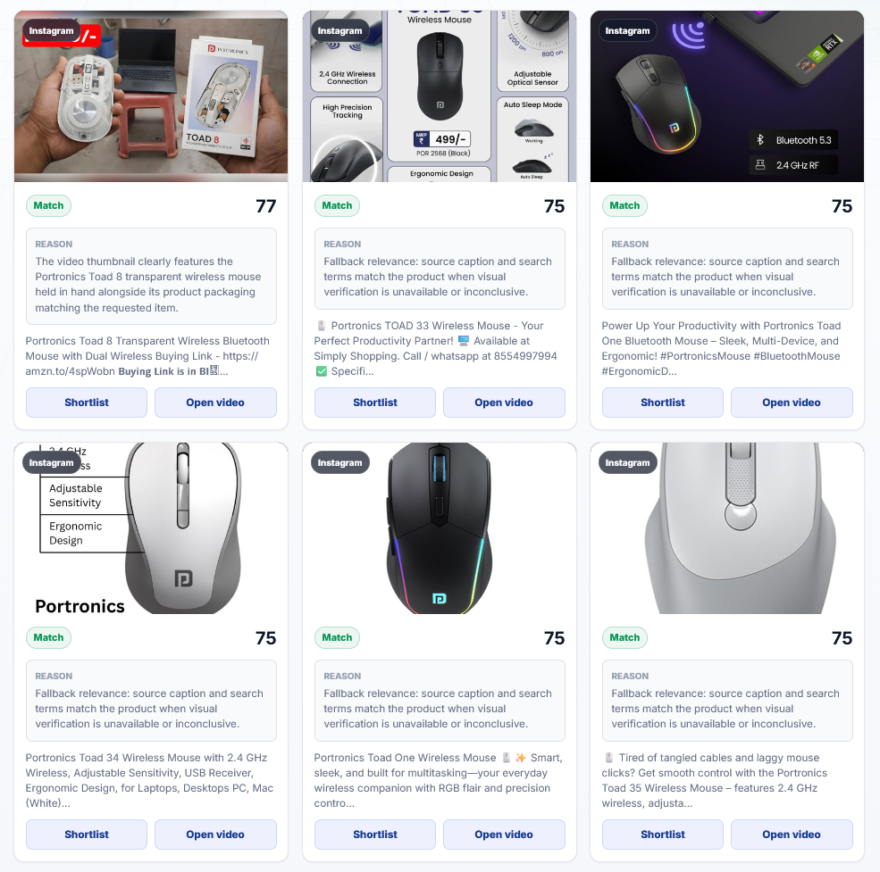
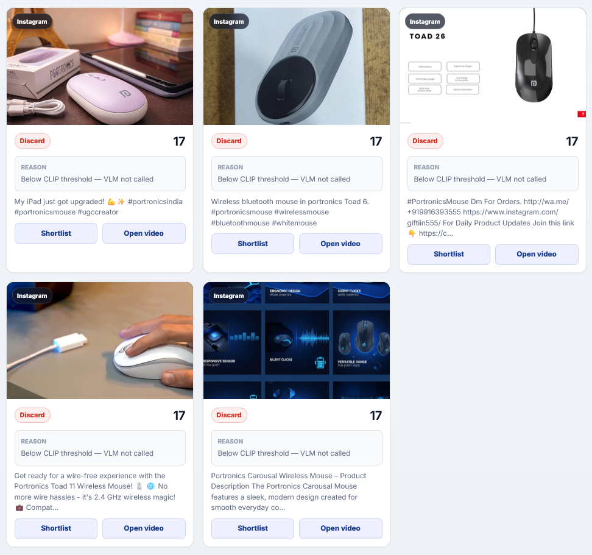

# Product Video Discovery Dashboard



## Overview

The Product Video Discovery Dashboard is an end-to-end, full-stack application designed to automatically discover, analyze, and shortlist highly relevant product videos from Instagram Reels. By leveraging advanced Large Vision-Language Models (VLMs), eligibility filters, and deduplication pipelines, the system curates Reels with no detected paid markers for any given product.

The organic claim is best-effort: scraped data cannot prove whether a post was boosted or undisclosed paid content. The app filters out non-Reels and obvious paid markers such as exact `#ad`, `#sponsored`, paid partnership flags, and related phrases, then records drop reasons for auditability.

---

## Features & Functionality

### 1. Intelligent Search Pipeline
Upon entering a product keyword, URL, or uploading an image, the backend orchestrates a multi-step background job:
- **Product Resolution**: Resolves the product details and generates optimized search queries.
- **Image Brain**: Extracts core attributes and generates search embeddings.
- **Configurable Collection**: Defaults to Instagram Reels only (`SEARCH_SOURCES=instagram`). Meta Ad Library remains available as an optional ads comparison source, but is not treated as organic content.

### 2. Multi-Layer Deduplication
To ensure diverse results, the system employs a robust deduplication pipeline:
- **Level 1 (Exact)**: Matches platform Video IDs and normalized URLs.
- **Level 2 (Visual)**: Uses pHash (perceptual hashing) and CLIP embeddings to detect visually identical thumbnails.
- **Level 3 (Textual)**: Uses SimHash to collapse videos with identical captions or ad copy.

### 3. VLM-Powered Scoring

Each collected video is scored based on its relevance to the target product. 
- A fast pass utilizes CLIP cosine similarity as a baseline.
- The top candidates are fed into a Vision-Language Model (Gemini) which simultaneously views the product image and the video thumbnail to assign a final confidence score and reasoning. 
- Videos scoring above a 60% threshold are marked with a green badge, while borderline results are flagged for manual review.

### 4. Robust Failure Handling

If an API fails, rate limits are hit, or a product is too niche to find 20 videos, the system fails gracefully. It provides the user with an exact breakdown of the shortfall (e.g., "16/20 - Shortfall of 4 videos") rather than returning an empty state or crashing.

---

## Environment Variables Configuration

The application requires specific environment variables to function correctly. Create a `.env` file in the root directory based on `.env.example`:

### Core Settings
- `NODE_ENV`: Set to `development` or `production`.
- `CORS_ORIGIN`: The URL of your frontend (e.g., `http://localhost:5173` or your Vercel URL).
- `DATABASE_URL`: Location of the SQLite database (defaults to `"file:./dev.db"`).

### Background Queue
- `QUEUE_MODE`: Set to `bullmq` to use Redis for background processing, or `inline` to process on the main thread without Redis.
- `REDIS_URL`: The connection string for your Redis instance.

### API Keys
- `GEMINI_API_KEY`: Required for the Image Brain and VLM scoring. Obtain from [Google AI Studio](https://aistudio.google.com/app/apikey).
- `APIFY_API_TOKEN`: Required for live Instagram Apify collection unless fixture mode is enabled. Obtain from [Apify](https://console.apify.com/account/integrations).
- `SEARCH_SOURCES`: Defaults to `instagram`. Add `meta` only for ads comparison mode.
- `TARGET_RESULTS`: Defaults to `20` and is sent to the UI/API so counts are not hardcoded.
- `META_AD_LIBRARY_ACCESS_TOKEN`: Optional. Required only when Meta ads mode uses official Meta API queries.

### Source Caveats
- Meta Ad Library is ads-only and should not be used as an organic Instagram source.
- Instagram Graph API hashtag search is an official alternative, but requires eligible professional account access/app review and has restrictive hashtag-query limits, so it is not the default provider.
- Meta Content Library is access-controlled and primarily intended for approved research access, so it is documented as a future alternative rather than the default integration.
- Apify scraping can be affected by Instagram changes, rate limits, ToS concerns, and usage cost. The backend caches raw provider responses, applies run caps, and returns partial results rather than padding or hanging.

---

## Startup Instructions

### Method A: One-Click Docker (Recommended)
The simplest way to run the entire stack (Frontend, Backend, and Redis) locally is via Docker.

1. Ensure Docker Desktop is installed and running.
2. Clone the repository and configure your `.env` file.
3. Run the following command in the root directory:
   ```bash
   docker compose up -d
   ```
4. Access the dashboard at `http://localhost:5173`.

### Method B: Manual Local Development
If you prefer to run the services individually without Docker:

1. **Start Redis**: 
   ```bash
   docker run -d -p 6379:6379 redis:7-alpine
   ```
2. **Start the Backend**:
   ```bash
   cd backend
   npm install
   npx prisma generate
   npx prisma db push
   npm run dev
   ```
   *The backend will start on `http://localhost:3001`.*
3. **Start the Frontend**:
   ```bash
   cd frontend
   npm install
   npm run dev
   ```
   *The frontend will start on `http://localhost:5173`.*

### Method C: Cloud Deployment (Vercel & Render)
This application is optimized for free cloud deployment using Vercel (Frontend) and Render (Backend/Redis).

1. **Redis**: Create a free "Key Value" Redis instance on Render.
2. **Backend**: Create a free "Web Service" on Render.
   - Root Directory: `backend`
   - Build Command: `npm install && npx prisma generate && npx prisma db push && npm run build`
   - Start Command: `npm start`
   - Add all environment variables (including the Render Redis URL).
3. **Frontend**: Create a new project on Vercel.
   - Root Directory: `frontend`
   - Ensure you have a `vercel.json` file routing `/api` to your Render backend.

---

## Demo & Evidence

- **Video Walkthrough**: A complete end-to-end demonstration of the application in action can be viewed in `App working.mp4`.
- **Test Evidence**: Automated end-to-end evaluation metrics are available in `eval/output/results.md`.

*Last updated: September 2026*
